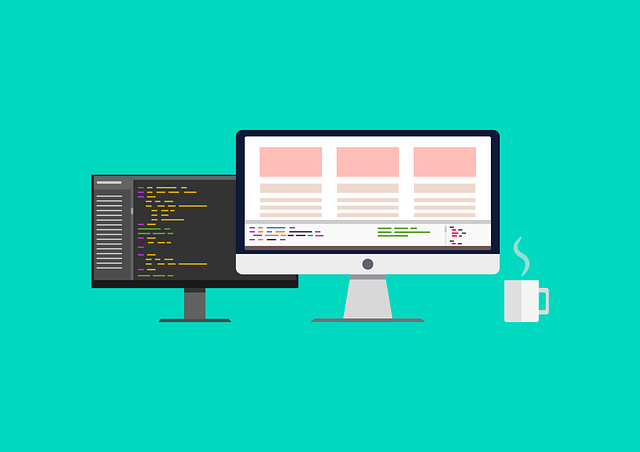

# 💻 프로그래밍 입문자와 FE 취준생을 위한 컨텐츠 모음

</img>

</a>
</a>

<!--
</a>
</a>
</a>
-->

 

 

## 소개 💬

- 프로그래밍 공부가 처음인 <strong>입문자</strong>이시거나, <strong>프론트엔드 개발자</strong>를 꿈꾸는 모든 분들에게 유익할 만한 컨텐츠(포스트 및 자료)들을 모아 함께 공유하고자 만든 저장소입니다. 😃

- <strong>입문자</strong>를 위한 컨텐츠, <strong>프론트엔드 취업 및 이직 준비</strong>에 도움이 될 컨텐츠를 위주로 공유하고 있으나, 어떤 IT 분야든 유익한 컨텐츠를 발견하면, 역시 함께 이곳에 공유하고 있습니다. 📙

- 이 오픈소스 저장소는 <strong><a href="https://velog.io/@sylagape1231/프론트엔드-취준생을-위한-게시글자료-모음">해당 velog 포스트</a></strong>를 통해 본격적으로 시작되었음을 밝힙니다. ⚡

  
 

#### 🔥 혹시 추천해주고 싶으신 컨텐츠가 따로 있으시다면..

- 아래 <strong>Etc.</strong>에 링크를 추가하고 <strong>Pull Request</strong>를 날려주시길 바랍니다.

- <strong>꼭 프론트엔드 관련 자료가 아니더라도 괜찮습니다.</strong>

- 제가 확인 후, 관련 카테고리로 이동시키겠습니다. 필요 시, 새로운 카테고리를 생성할 수도 있습니다.

- 저작권법에 위반되는 컨텐츠는 공유는 ❌

 

## 📖 목차

📌 <a href="https://github.com/SangYoonLee1231/content-list-for-frontend-dreamers#-%ED%95%99%EC%8A%B5-%EC%9E%90%EB%A3%8C">학습 자료</a>

📌 <a href="https://github.com/SangYoonLee1231/content-list-for-frontend-dreamers#-%EA%B0%9C%EB%B0%9C%EC%9E%90%EB%A5%BC-%EC%9C%84%ED%95%9C-%EA%B3%B5%EB%B6%80%EB%B2%95-%EB%B0%8F-%EA%B0%80%EC%9D%B4%EB%93%9C">개발자를 위한 공부법 및 가이드</a>

📌 <a href="https://github.com/SangYoonLee1231/content-list-for-frontend-dreamers#-%EC%BD%94%EB%94%A9%ED%85%8C%EC%8A%A4%ED%8A%B8-%EB%8C%80%EB%B9%84-%EB%B0%8F-ps-%EA%B3%B5%EB%B6%80">코딩테스트 대비 및 PS 공부</a>

📌 <a href="https://github.com/SangYoonLee1231/content-list-for-frontend-dreamers#-%EC%B7%A8%EC%97%85-%EB%B0%8F-%EC%9D%B4%EB%A0%A5%EC%84%9C--%ED%8F%AC%ED%8A%B8%ED%8F%B4%EB%A6%AC%EC%98%A4-%EC%A4%80%EB%B9%84">취업 및 이력서 & 포트폴리오 준비</a>

📌 <a href="https://github.com/SangYoonLee1231/content-list-for-frontend-dreamers#-fe-%EB%A9%B4%EC%A0%91-%EC%A7%88%EB%AC%B8-%EB%B0%8F-%ED%95%84%EC%9A%94%ED%95%9C-%EC%A7%80%EC%8B%9D">FE 면접 질문 및 필요한 지식</a>

📌 <a href="https://github.com/SangYoonLee1231/content-list-for-frontend-dreamers#-%ED%94%84%EB%A1%9C%EC%A0%9D%ED%8A%B8-%ED%9B%84%EA%B8%B0">프로젝트 후기</a>

📌 <a href="https://github.com/SangYoonLee1231/content-list-for-frontend-dreamers#-etc">Etc.</a>

  

## 📌 학습 자료

### For 프로그래밍 입문자

- <a href="https://www.boostcourse.org/cs112">[프로그래밍 입문, C언어] 모두를 위한 컴퓨터 과학</a> (하버드 대학 데이비드 말란 교수님의 CS50 강의 (자막 有))

- <a href="https://youtu.be/M6kQTpIqpLs">[파이썬 1시간 30분 강의] 코딩 1시간만에 배우기 - 파이썬 (ft. 실리콘밸리 엔지니어)</a> (By 테크보이 워니님)

- <a href="https://youtu.be/kWiCuklohdY">[파이썬 6시간 강의] 파이썬 코딩 무료 강의 (기본편)</a> (By 나도 코딩님)

- <a href="https://youtube.com/playlist?list=PLVsNizTWUw7EYNg_fyTEFYgd84p2uK-aS">[C언어 강의] 혼자 공부하는 C 언어</a> (By 서현우님)

- <a href="https://codeup.kr/problemsetsol.php?psid=23">[문제 풀이 입문] CodeUp 기초 100제</a>

- <a href="https://www.codetree.ai/missions/4">[문제 풀이 입문] Code Tree - Novice Low</a>

- <a href="https://dojang.io/">코딩 도장</a>

### For 예비 프론트엔드 개발자

- <a href="https://youtube.com/playlist?list=PLuHgQVnccGMDZP7FJ_ZsUrdCGH68ppvPb">생활코딩 - WEB 1 (무료 강의)</a> (By 이고잉님)

- <a href="https://nomadcoders.co/kokoa-clone/lobby">노마드 코더 - 코코아톡 클론코딩 (유료 강의)</a> (By 니꼬쌤)

- <a href="https://nomadcoders.co/javascript-for-beginners/lobby">노마드 코더 - 바닐라 JS로 크롬 앱 만들기 (무료 강의)</a>

- <a href="https://www.edwith.org/htmlcss">초보자를 위한 HTML & CSS 동작과 원리 (무료 강의)</a> (By 윤지수님)

- <a href="https://www.boostcourse.org/web316/joinLectures/12943">웹 프로그래밍 (풀스택) (무료 강의)</a> (By 윤지수님)

- <a href="https://ko.javascript.info/">모던 JavaScript 튜토리얼 (JavaScript 학습 사이트)</a>

- <a href="https://poiemaweb.com/">Web Development Tutorial (웹 개발 튜토리얼 사이트)</a> (By 이웅모님)

- <a href="https://react.vlpt.us/">벨로퍼트와 함께하는 모던 리액트</a> (By velopart님)

- <a href="https://velog.io/@velopert/react-hooks">리액트(React)의 Hooks 완벽 정복하기</a> (By velopart님)

- <a href="https://ko.reactjs.org/tutorial/tutorial.html">React 공식 문서</a>

 

## 📌 개발자를 위한 공부법 및 가이드

- <a href="https://youtu.be/d3Kp8QB74-4">개발자 되는법 - 코딩 처음부터 배울때 뭐부터 해야해요?</a> (By 테크보이 워니님)

- <a href="https://youtu.be/Xxg581iRWks">개발자 되려면 어떻게 코딩 배워야 돼요? - 현직 개발자가 알려드립니다.</a> (By 테크보이 워니님)

- <a href="https://brunch.co.kr/@supims/2#comment">개발자가 되고픈 어린 친구들에게...</a> (By 신현묵님)

- <a href="https://youtu.be/x7k4iVDMDhM">초보자는 어떤 프로그래밍 언어를 배워야 하나요?</a> (By 야살님)

### 프론트엔드

- <a href="https://wayhome25.github.io/etc/2017/02/21/for-junior-web-developer/">초보 웹 개발자를 위하여</a> (By 정호영님)

- <a href="https://youngban.tistory.com/16">비전공자 웹개발자로서 살아남는 법 정리본(출처:okky)</a> (By 렛츠기릿님)

- <a href="https://seunghyun90.tistory.com/77">프론트엔드 개발, 뭐하는 직종이야?</a> (By paul90님)

- <a href="https://medium.com/codesquad-kr/%EC%9B%B9-%ED%94%84%EB%A1%A0%ED%8A%B8%EC%97%94%EB%93%9C-%EA%B0%9C%EB%B0%9C%EC%9E%90-%EC%96%B4%EB%96%BB%EA%B2%8C-%EC%A4%80%EB%B9%84%ED%95%B4%EC%95%BC-%ED%95%A0%EA%B9%8C-5ac7bb6ff2a9">웹 프론트엔드 개발자, 어떻게 준비해야 할까?</a> (By 윤지수님)

- <a href="https://haranglog.tistory.com/9">2020 FrontEnd 개발자가 되기 위한 10가지 방법</a> (By Harang님)

- <a href="https://velog.io/@ansrjsdn/%ED%94%84%EB%A1%A0%ED%8A%B8%EC%97%94%EB%93%9C-%EC%B6%94%EC%B2%9C-%EC%9E%90%EB%A3%8C-%EB%AA%A8%EC%9D%8C">프론트엔드 추천 자료 모음</a> (By ansrjsdn님)

- <a href="https://youtu.be/YbVuqWD12Ko">웹 프론트엔드 개발자 아무것도 모르는 상태에서 취업까지 하는 구체적인 준비방법</a> (By 라매개발자님)

 

## 📌 코딩테스트 대비 및 PS 공부

- <a href="https://covenant.tistory.com/141">용감하게 시작하는 코딩테스트 1편</a> (By Covenant님)
  (코드를 간결하고 효율적으로 짤 수 있는 여러 팁 정리)

- <a href="https://subinium.github.io/PS-Study-Types-and-Complements/">개인이 생각하는 알고리즘(PS/CP) 공부 유형 및 보완법</a> (By 안수빈님)

- <a href="https://shoark7.github.io/programming/algorithm/how-i-approach-algorithm-from-my-way">내가 알고리즘 문제를 푸는 방법</a> (By SUNGHWAN PARK님)

- <a href="https://velog.io/@jeon3029/%EC%BD%94%EB%94%A9%ED%85%8C%EC%8A%A4%ED%8A%B8-%EC%A4%80%EB%B9%84-%EC%82%AC%EC%9D%B4%ED%8A%B8-%EB%AA%A8%EC%9D%8C%EC%A7%91%EB%8B%A8%EC%88%9C%EB%A7%81%ED%81%AC%EB%A7%8C">코딩테스트 준비 사이트 모음집(단순링크만)</a> (By 태빵님)

- <a href="https://covenant.tistory.com/224">코딩테스트 대비를 위한 백준 문제 추천</a> (By Covenant님) (대략 80문제, 주제별로 정리)

- <a href="https://gliver.tistory.com/6">알고리즘 공부법 (코테(또는 대회)를 위한 공부법)</a> (By Gliver님)

 

## 📌 취업 및 이력서 & 포트폴리오 준비

- <a href="https://zuminternet.github.io/zum-front-recurit-review/">주니어 프론트엔드 개발자의 채용 프로세스 참여 후기</a> (By 황준일님) (ZUM에서 진행)

- <a href="https://brunch.co.kr/@javajigi/14">내 업의 본질은 무엇인가?</a> (By 박재성님)  
  (우아한테크코스 이사님께서 우테코 지원자들의 불합격 이유를 피드백하며 작성한 포스트)

- <a href="https://medium.com/%EC%98%A4%EC%9D%BC%EB%82%98%EC%9A%B0-%ED%8C%80-%EB%B8%94%EB%A1%9C%EA%B7%B8/%EC%A3%BC%EB%8B%88%EC%96%B4-%EA%B0%9C%EB%B0%9C%EC%9E%90%EA%B0%80-%ED%8F%AC%ED%8A%B8%ED%8F%B4%EB%A6%AC%EC%98%A4%EB%A5%BC-%EC%A4%80%EB%B9%84%ED%95%A0-%EB%95%8C-%EC%95%8C%EC%95%84%EB%91%90%EB%A9%B4-%EC%A2%8B%EC%9D%80-%EA%B2%83%EB%93%A4-ac5304a9ecb9">신입 개발자가 포트폴리오를 준비할 때 알아두면 좋은 것들</a> (By 김태성님)  
   (채용 담당자께서 알려주는 좋은 포트폴리오 작성법)

- <a href="https://youtu.be/z1023iDXonc">스타트업 신입 취업성공에 영향을 미치는 요소</a> (By 라매개발자님)

- <a href="https://f-lab.medium.com/%EC%B9%B4%EC%B9%B4%EC%98%A4-%ED%95%A9%EA%B2%A9-%EA%B0%9C%EB%B0%9C%EC%9E%90-%EC%9D%B4%EB%A0%A5%EC%84%9C-1-by-f-lab-d7eff8e39422">카카오 합격 개발자 이력서 1</a> (By. F-Lab)

- <a href="https://wonny.space/writing/work/engineer-resume">개발자 이력서 작성하기 (feat. 이력서 공개)</a> (By Wonny (워니)님)

- <a href="https://minieetea.com/2021/04/archives/6193">잘 정리된 이력서보다 중요한 것 </a> (By minieetea님)

- <a href="https://velog.io/@junghyeonsu/그런-포트폴리오로-괜찮은가">그런 포트폴리오로 괜찮은가 </a> (By 장현수님)

 

## 📌 FE 면접 질문 및 필요한 지식

- <a href="https://coding-restaurant.tistory.com/137">신입 개발자 면접 준비 (1) : 일반 면접 관련 예상 질문(개발 외)</a> (By 코딩맛집님)

- <a href="https://velog.io/@suyeonme/%ED%9B%84%EA%B8%B0-%ED%94%84%EB%A1%A0%ED%8A%B8%EC%97%94%EB%93%9C-%EA%B0%9C%EB%B0%9C%EC%9E%90-%EB%A9%B4%EC%A0%91-%EC%A0%95%EB%A6%AC">프론트엔드 개발자 면접 정리</a> (By suyeonme님)

- <a href="https://github.com/junh0328/prepare_frontend_interview">prepare_frontend_interview 레포지토리</a>

- <a href="https://github.com/baeharam/Must-Know-About-Frontend">취준생이 반드시 알아야 할 프론트엔드 지식들 레포지토리</a>

- <a href="https://velog.io/@honeysuckle/%EC%8B%A0%EC%9E%85-%ED%94%84%EB%A1%A0%ED%8A%B8%EC%97%94%EB%93%9C-%EB%A9%B4%EC%A0%91-%EC%A7%88%EB%AC%B8-%EB%AA%A8%EC%9D%8C">프론트엔드 면접 질문 모음</a> (By honeysuckle님)

- <a href="https://realmojo.tistory.com/300">프론트엔드 개발자 기술면접 인터뷰 질문 모음(업데이트) (답변 있음)</a> (By 오렌지셔츠님)

- <a href="https://sunnykim91.tistory.com/121">프론트엔드 개발자 면접 질문(기술면접) 정리</a> (By sunnykim91님)

- <a href="https://velog.io/@wkahd01/%ED%94%84%EB%A1%A0%ED%8A%B8%EC%97%94%EB%93%9C-%EB%A9%B4%EC%A0%91-%EB%AC%B8%EC%A0%9C-%EC%9D%80%ED%96%89-HTML-%EC%A7%88%EB%AC%B8-%EB%8B%B5%EB%B3%80#css%EC%97%90%EC%84%9C-margin%EA%B3%BC-padding%EC%9D%B4%EB%9E%80">프론트엔드 면접 문제 은행 질문 답변</a> (By wkahd01님)

- <a href="https://frontendinterviewhandbook.com/kr/html-questions/">프론트엔드 인터뷰 핸드북 (번역)</a> (By Yangshun Tay님)

- <a href="https://velog.io/@heyiminhye/안녕하세요-프론트엔드-신입에-지원합니다">안녕하세요, 프론트엔드 신입에 지원합니다.</a> (By heyiminhye님)

- <a href="https://gyoogle.dev/blog/">신입 개발자 전공 지식 & 기술 면접 백과사전</a> (By Gyuseok Kim님)

- <a href="https://github.com/brave-people/brave-tech-interview">Brave Tech Interview 기술면접 문제 해설 레포지토리</a>

- <a href="https://velog.io/@heyum/series/Lecture-Concept">[CS 기본 개념] 전공면접 준비자료 (블로그 포스팅 시리즈)</a> (By heyum님)

- <a href="https://www.youtube.com/watch?v=dh406O2v_1c">브라우저에 google.com을 치면 일어나는 일 (유튜브 영상 / 영어)</a>

 

## 📌 프로젝트 후기

### 개인 프로젝트

- <a href="https://velog.io/@junghyeonsu/React-Numble-Challenge-다른-색깔-찾기-게임-만들기">(2022/02/14 랭크기능 추가) [React Numble Challenge] 다른 색깔 찾기 게임 만들기</a> (By 장현수님)

- <a href="https://velog.io/@eunjin/Javascript-Project인스타그램-클론코딩">[VanillaJS Project] 인스타그램 클론코딩</a> (By 이은진님)

- <a href="https://velog.io/@heekang/Vanilla-JS-자라나는-나무-만들기-1">[Vanilla JS] 자라나는 나무 만들기 - 1</a> (By 신희강님)

- <a href="https://velog.io/@danmin20/프론트엔드-개발자의-포트폴리오-웹사이트">프론트엔드 개발자의 포트폴리오 웹사이트</a> (By 이정민님)

### 팀 프로젝트

(준비중..)

 

## 📌 Etc.

- <a href="http://jamestic.egloos.com/3288119">성장의 조건</a> (By 제임스님)

- <a href="https://blog.shiren.dev/2021-05-17/">개발을 잘 하는 습관</a> (By Sungho Kim님)

- <a href="https://brunch.co.kr/@goodgdg/142">지원자도 회사를 평가합니다. 이렇게요.</a> (By 유디v님)

- <a href="https://dnf-lover.tistory.com/entry/%EA%B0%9C%EB%B0%9C%EC%9E%90%EB%93%A4%EC%9D%B4-%EA%B0%9C%EB%B0%9C%EC%AA%BD%EC%9C%BC%EB%A1%9C-%EA%B0%80%EB%A0%A4%EA%B3%A0-%ED%95%98%EB%8A%94-%EB%B9%84%EC%A0%84%EA%B3%B5%EC%9E%90%EB%93%A4%ED%95%9C%ED%85%8C-%EA%B0%80%EC%A7%80-%EB%A7%90%EB%9D%BC%EA%B3%A0-%ED%95%98%EB%8A%94-%EC%9D%B4%EC%9C%A0">개발자들이 개발쪽으로 가려고 하는 비전공자들한테 가지 말라고 하는 이유</a> (By botho님) (개발자의 현실 : 지옥편 느낌..👿)

- <a href="https://velog.io/@eddy_song/git-3levels-1">초등학생에게 Git을 설명해본다면? (Git 1편)</a> (By Eddy님)

- <a href="https://velog.io/@eddy_song/git-3levels-4">초등학생에게 Git branch와 merge를 설명해본다면? (Git 2편)</a> (By Eddy님)

- <a href="https://open-support.tistory.com/entry/%EA%B5%AD%EB%82%B4-%EA%B0%9C%EB%B0%9C%EC%9E%90-%EC%BB%A4%EB%AE%A4%EB%8B%88%ED%8B%B0?fbclid=IwAR2-VBu8F6jXnd_lq3TFp6LsW4RRuNXW6mPSgi3bi4tta2YDSYSU-0-bLqc">국내/한국 개발자 커뮤니티 모아보기</a> (By 오픈서포트님)

- <a href="https://jbee.io/essay/good_questionor/">질문을 잘하는 개발자</a> (By 한재엽님)

- <a href="https://blog.pocu.academy/ko/2019/03/15/how-to-ask-questions-effectively.html">가이드: 효과적인 온라인 질문법</a> (By 윤아님)

- <a href="https://youtu.be/_g29ihPpDnE">30년 개발자의 ‘개발자로 성공하기 위한 5가지 노하우’</a> (By 박종천님)

- <a href="https://agilemanifesto.org/iso/ko/manifesto.html">애자일 소프트웨어 개발 선언문</a>
